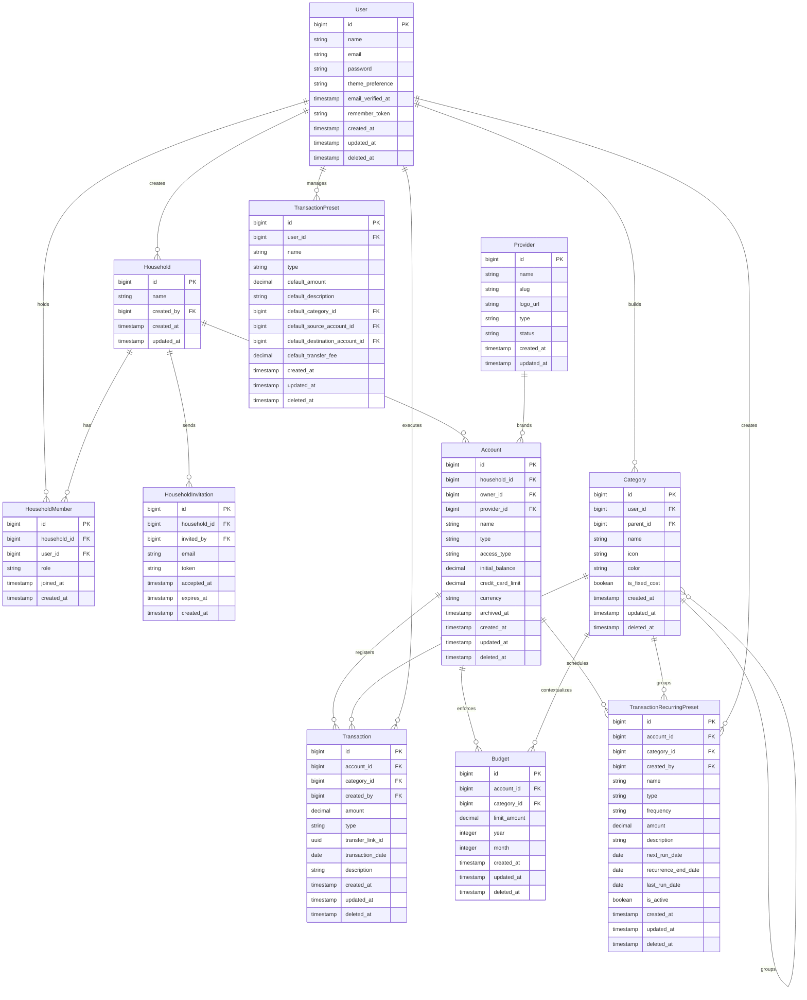

# FinTrack Household Source of Truth

**Personal & Shared Household Finance Tracker**

|                         |                                                            |
| ----------------------- | ---------------------------------------------------------- |
| **Document Version**    | 1.1 — Revised after spec review                            |
| **System Architecture** | Laravel · Inertia.js · Svelte                              |
| **Target Viewport**     | Mobile-first, 375px–430px portrait with responsive scaling |
| **Release Scope**       | Version 1.0 — MVP                                          |
| **Currency Model**      | Single-currency per account                                |

---

## 1. Purpose & Problem Statement

FinTrack is a mobile-first web application built for individuals, couples, and households that need a shared, transparent way to track cash flow across personal and joint accounts.

Traditional personal finance tools either force desktop-heavy workflows or overcomplicate household money with enterprise double-entry accounting. FinTrack solves this by focusing on fast household cash flow tracking, shared account visibility, and friction-minimizing mobile entry.

### Core Household Problems Solved

- Fragmented account visibility across physical wallets, bank accounts, e-wallets, and credit cards.
- High friction on-the-go entry, where users forget to log purchases unless the app is faster than the payment moment.
- Shared financial blindspots when household members cannot audit joint spending without sharing bank credentials.
- Setup exhaustion from repetitive entry without quick-entry presets.

---

## 2. Household Cash-Flow Philosophy

FinTrack deliberately avoids enterprise bookkeeping complexity. It uses a simplified household ledger model that is:

- **Type-driven**: each transaction carries a `type` (`income`, `expense`, `transfer_out`, `transfer_in`, `fee`) that unambiguously determines its balance impact. No separate direction field.
- **Forgiving**: soft deletes let users correct mistakes instantly.
- **Human-readable**: fees and transfers are modeled as clear, flat ledger rows rather than hidden amortization.
- **Household-first**: shared and personal account views are first-class, controlled by a simple household membership model.

---

## 3. System Goals & Non-Goals

### Goals

- Unified account switching between personal and joint household accounts.
- Velocity-first data logging with transaction presets ("templates"), quick-add controls, and mobile-optimized inputs.
- Household sharing via a simple household membership model (owner + partner).
- Budget threshold alerts at 80% and 100% — in-app only.
- Actionable household insights via simplified mobile reports backed by SQL aggregates and Redis cache.

### Non-Goals for MVP

- Strict double-entry accounting or corporate balance sheets.
- Third-party investment performance feeds or brokerage sync.
- Automated open banking / Plaid-style synchronization.
- Multi-currency real-time conversion; each account is a single currency container.
- Native mobile apps — web-responsive only.
- CSV import or export.
- Email notification delivery.

---

## 4. Target Users & Personas

### The On-The-Go Individual

- Manages daily income and spending across a debit card, e-wallet, and cash.
- Needs one-tap entry and fast category selection at the point of sale.

### The Household Couple

- Shares one or more joint accounts while maintaining separate personal spending buckets.
- Needs instant, transparent joint visibility and audit trails for who spent what.
- Primary MVP use case: two users in a single household.

---

## 5. User Stories

| As a...          | I want to...                                         | So that...                                 |
| ---------------- | ---------------------------------------------------- | ------------------------------------------ |
| new user         | register and set up my first account                 | I can start tracking immediately           |
| user             | add transactions to an account manually              | I can track my spending                    |
| user             | categorize a transaction                             | I can see where my money is going          |
| user             | set a monthly budget per category                    | I can stay within my limits                |
| user             | see a dashboard summary of all my accounts           | I get a complete picture of my finances    |
| user             | save a transaction preset ("template")               | I can log frequent entries in one tap      |
| user             | attach a photo or file to a transaction              | I can keep receipts linked to spending     |
| account owner    | invite my partner to my household                    | we can share joint accounts                |
| household member | see who created or edited each transaction           | there is a clear audit trail               |
| user             | set up a recurring transaction rule                  | regular expenses are tracked automatically |
| user             | receive an alert when a budget is close to its limit | I can act before going over                |

---

## 6. Mobile-First Experience & UI Mechanics

### 6.1 Fixed Bottom Navigation

The app uses a persistent bottom nav bar that keeps the current household context visible and provides fast access to:

- Dashboard
- Accounts
- Quick add (+)
- Ledger feed
- Reports

### 6.2 Quick-Add Bottom Sheet

The central quick-add button opens a slide-up drawer with:

- Preset carousel for one-tap transaction blueprints ("templates").
- Amount field with `inputmode="decimal"`.
- Category and account selectors optimized for touch.
- A fixed primary save button.

### 6.3 Input Optimization

- Use `inputmode="decimal"` for amount fields.
- Disable autocorrect and autocapitalize for form fields.
- Keep touch targets at least 48×48px.

---

## 7. Feature Scope

### Authentication & User Management

| Feature                   | Priority | Notes                       |
| ------------------------- | -------- | --------------------------- |
| Registration & login      | P0       | Handled by starter template |
| Email verification        | P0       | Starter template            |
| Password reset            | P0       | Starter template            |
| Profile settings          | P1       | Minimal settings page       |
| Two-factor authentication | P2       | Schema ready; UI deferred   |

### Accounts

| Feature                      | Priority | Notes                                             |
| ---------------------------- | -------- | ------------------------------------------------- |
| Create/edit/archive accounts | P0       | Personal and joint accounts; `archived_at` toggle |
| Initial balance              | P0       | Set starting balance on account creation          |
| Account dashboard            | P0       | Balance, recent transactions, budgets             |
| Provider selection           | P0       | FK to seeded `providers` table                    |
| Global dashboard             | P1       | Aggregated view across accounts                   |
| Per-account currency         | P1       | Single currency per account                       |

### Transactions

| Feature                      | Priority | Notes                                           |
| ---------------------------- | -------- | ----------------------------------------------- |
| Add/edit/delete transactions | P0       | Soft delete only                                |
| Categorization               | P0       | User-defined 2-level categories with icon/color |
| Transfer between accounts    | P0       | Creates `transfer_out` + `transfer_in` row pair |
| Search/filter                | P1       | Date, category, amount, keyword                 |
| Recurring presets            | P1       | Daily queue generates due entries               |
| Receipt attachments          | P2       | Post-MVP images/PDFs                            |

### Budgets

| Feature                      | Priority | Notes                               |
| ---------------------------- | -------- | ----------------------------------- |
| Monthly budgets per category | P0       | Per-account limits                  |
| Progress visualization       | P1       | Dashboard status bars               |
| Overspend alerts             | P1       | 80% / 100% thresholds — in-app only |

### Transaction Presets ("Templates")

| Feature                            | Priority | Notes                                      |
| ---------------------------------- | -------- | ------------------------------------------ |
| Save a transaction as a preset     | P0       | Name, type, amount, category, account      |
| Use a preset in quick-add carousel | P0       | Pre-fills form; user adjusts before saving |
| Edit / delete presets              | P0       | Full CRUD                                  |
| Recurring preset rules             | P1       | Separate entity; daily scheduled execution |

### Household Sharing

| Feature                          | Priority | Notes                                    |
| -------------------------------- | -------- | ---------------------------------------- |
| Create a household               | P0       | One household per user                   |
| Invite partner by email          | P0       | Signed token, expires 48h                |
| Accept / decline invitation      | P0       | Activates household membership           |
| Personal vs joint account access | P0       | Personal: owner only; joint: all members |
| Remove member                    | P0       | Household owner only                     |
| Transaction audit trail          | P1       | `created_by` on every transaction        |

### Reporting

| Feature                  | Priority | Notes                                       |
| ------------------------ | -------- | ------------------------------------------- |
| Household analytics      | P1       | Mobile-friendly trend and budget reports    |
| Income vs expense trend  | P1       | Monthly dual-bar with surplus/deficit badge |
| Category leak report     | P1       | Expense share by category                   |
| Joint contribution split | P1       | Inflow share per household member           |
| Credit utilization       | P1       | Gauge per credit card account               |
| Fixed vs variable        | P1       | Fixed cost vs discretionary breakdown       |

### Integrations

| Feature                  | Priority | Notes            |
| ------------------------ | -------- | ---------------- |
| Bank / open banking sync | P3       | Out of MVP scope |
| Multi-currency / FX      | P3       | Future expansion |

---

## 8. Functional Specification

### 8.1 Account Classification

Accounts represent household cash containers and include:

- `debit_account`: checking, savings, payroll.
- `credit_card`: credit instruments, tracked with limits.
- `cash_wallet`: physical cash envelopes.
- `e_wallet`: digital balances like GoPay, OVO, Dana.
- `investment`: simplified retail investment allocations.

Accounts carry:

- `household_id`: the household this account belongs to
- `owner_id`: user who created and administers the account
- `access_type`: `personal` (owner only) or `joint` (all household members)
- `provider_id`: FK to the `providers` table; optional brand reference
- `initial_balance`: decimal starting balance before any transactions are recorded
- `credit_card_limit`: optional, credit cards only
- `currency`: ISO 4217 code
- `archived_at`: nullable timestamp; archived accounts are hidden from active views

Account balance is always computed as:

```
balance = initial_balance
        + SUM(income + transfer_in transactions)
        - SUM(expense + transfer_out + fee transactions)
WHERE deleted_at IS NULL
```

All balance and aggregate calculations use SQL `SUM` / `CASE WHEN` — never PHP iteration over collections.

### 8.2 Transaction Engine

The ledger uses five transaction types. Direction is unambiguous from `type` — no separate direction field exists.

| Type           | Direction | Notes                                           |
| -------------- | --------- | ----------------------------------------------- |
| `income`       | inflow    | Money entering the account                      |
| `expense`      | outflow   | Money leaving the account                       |
| `transfer_out` | outflow   | Source leg of a transfer between accounts       |
| `transfer_in`  | inflow    | Destination leg of a transfer between accounts  |
| `fee`          | outflow   | Transfer fee charged against the source account |

Transfers generate 2–3 linked ledger rows using `transfer_link_id` (UUID):

1. `transfer_out` row on the source account.
2. `transfer_in` row on the destination account.
3. Optional `fee` row on the source account, if a fee amount is provided.

Transactions are soft-deleted only — never hard-deleted.

### 8.3 Transaction Presets ("Templates")

Transaction presets are what the user refers to as "templates". They are reusable quick-entry blueprints that pre-fill the transaction form without locking values.

Presets support frequent actions such as:

- recurring household purchases
- salary or allowance deposits
- top-ups for e-wallets

Users can adjust any field (amount, description, category, account, date) after selecting a preset. Saving creates a normal transaction row — the preset is not modified.

Presets appear in the quick-add carousel on the bottom sheet.

Recurring automation (auto-generated transactions on a schedule) lives in a separate `transaction_recurring_presets` entity and is not the same as a manual quick-entry preset.

### 8.4 Household Reports

Report screens focus on household behavior, not corporate accounting. All report data is computed via SQL aggregate queries — never by fetching and reducing collections in PHP. Results are cached in Redis (fallback: database cache driver) with tag-based invalidation on transaction writes.

**Cache strategy:**

- Past months: permanent cache (immutable data).
- Current month: short TTL (~5 minutes), invalidated on `TransactionSaved` / `TransactionDeleted` events.
- Credit utilization: always live, never cached.

#### 8.4.1 Income vs Expense Trend

- Dual-bar chart comparing monthly inflow and outflow.
- Displays a `Surplus` or `Deficit` badge and net savings rate.

#### 8.4.2 Category Leak Report

- Donut chart showing expense share by category.
- Highlights top spending categories.

#### 8.4.3 Joint Contribution Split

- Side-by-side gauge showing inflow share by household member in joint accounts.
- Returns an empty state for personal accounts.

#### 8.4.4 Credit Utilization

- Gauge for each credit card account.
- Warning at 30% utilization; high-risk at 70%+.
- Always live — not cached.

#### 8.4.5 Fixed vs Variable Calculator

- Compares recurring fixed costs (`is_fixed_cost = true`) against variable spending.
- Identifies budget pressure from variable categories.

#### 8.4.6 Report Design Principles

- Mobile-first layout: charts and gauges stack vertically.
- Badge states for budget health: `On track`, `At risk`, `Over budget`.
- Drill-through from summary charts to filtered transaction lists.
- Persist user-selected date range in URL query params.

### 8.5 Budget Alerts

Budget alerts are generated when category spending crosses thresholds:

- 80% of limit: `at_risk` state.
- 100% of limit: `over_budget` state.

Alerts are in-app only for MVP. Email delivery is post-MVP.

### 8.6 Architecture Decisions

The following decisions were made during spec review to keep the architecture simple and unambiguous.

#### 8.6.1 Transaction type is the single source of direction — RESOLVED

`direction` column removed. Transaction `type` (`income`, `expense`, `transfer_out`, `transfer_in`, `fee`) unambiguously determines balance impact. Balance is a simple SQL `CASE WHEN` with no subqueries.

#### 8.6.2 No account-category assignment layer — RESOLVED

`account_categories` table removed. Categories are user-owned and available for use on any transaction. No per-account assignment needed.

#### 8.6.3 Manual presets and recurring presets are separate entities — RESOLVED

`transaction_presets` = manual quick-entry blueprints (what the user calls "templates").
`transaction_recurring_presets` = scheduled auto-generation rules. These are distinct entities with no overlap.

#### 8.6.4 Caching is derived data, not source of truth — RESOLVED

Redis / database cache stores computed balances and report totals. The ledger is always the authoritative source. Cache is invalidated by event listeners on transaction writes. Fallback recalculates from the ledger on cache miss.

#### 8.6.5 Household model replaces per-account membership — RESOLVED

`account_members` table replaced by a household model: `households`, `household_members`, `household_invitations`. Personal accounts are visible to `owner_id` only. Joint accounts are visible to all active household members. No per-account role complexity in MVP.

#### 8.6.6 Soft delete discipline — RESOLVED

`deleted_at` filtering is explicit in all transaction queries, balance calculations, and report aggregates. Budget records also carry `deleted_at` for soft-delete support.

#### 8.6.7 Account balance semantics — RESOLVED

`initial_balance` stores the pre-app starting balance. Credit utilization is calculated separately from the standard balance formula. Investment and wallet balances follow the same formula as debit accounts.

#### 8.6.8 Provider as a table relation — RESOLVED

`provider` string field replaced with `provider_id` FK to a seeded `providers` table. Enables future import integrations tied to specific providers.

---

## 9. Data Model Summary

### 9.0 Scalable Data Model Principles

- Keep core entities focused on a single responsibility.
- Use the household model for sharing — not per-account membership tables.
- `type` drives transaction behavior; no redundant `direction` field.
- All balances and aggregates computed via SQL — never in PHP.
- Treat Redis/database cache as derived data; the ledger is always authoritative.
- No DB enum columns — use `string` columns with PHP-backed enum casts.

### 9.1 Entity Relationships

- `Household` → `HouseholdMember`: one household has many members.
- `Household` → `Account`: one household has many accounts.
- `Account` → `Transaction`: one-to-many; `Transaction` is the ledger source of truth.
- `User` → `Category`: one-to-many; categories are user-owned with 2-level hierarchy via `parent_id`.
- `User` → `TransactionPreset`: one-to-many for manual quick-entry blueprints.
- `Account` → `Budget`: one-to-many for category-based budget constraints per period.
- `Transaction` → `Category`: optional many-to-one; uncategorized transactions are allowed.
- `Account` → `TransactionRecurringPreset`: one-to-many for scheduled transaction rules.

### Key Entities

- `users`
- `providers`
- `households`
- `household_members`
- `household_invitations`
- `accounts`
- `categories`
- `transactions`
- `transaction_presets`
- `budgets`
- `transaction_recurring_presets`

### Transaction Table Highlights

- `account_id`
- `category_id` nullable
- `created_by`
- `amount`
- `type`: `income` / `expense` / `transfer_out` / `transfer_in` / `fee`
- `transfer_link_id` nullable uuid
- `transaction_date`
- `description`
- `deleted_at`

### 9.2 Entity Relationship Diagram



### 9.3 Entity Detail

#### Users (`users`)

| Column               | Type      | Notes                                                             |
| -------------------- | --------- | ----------------------------------------------------------------- |
| `id`                 | bigint    | PK, auto-increment                                                |
| `name`               | string    | User full name                                                    |
| `email`              | string    | Required, unique                                                  |
| `password`           | string    | Hashed password                                                   |
| `theme_preference`   | string    | Nullable; DaisyUI theme name e.g. `light`, `dark`; null = app default |
| `email_verified_at`  | timestamp | Nullable                                                          |
| `remember_token`     | string    | Nullable                                                          |
| `created_at`         | timestamp |                                                                   |
| `updated_at`         | timestamp |                                                                   |
| `deleted_at`         | timestamp | Soft delete                                                       |

#### Providers (`providers`)

Seeded reference data. No user-facing CRUD in MVP.

| Column       | Type      | Notes                                                                    |
| ------------ | --------- | ------------------------------------------------------------------------ |
| `id`         | bigint    | PK, auto-increment                                                       |
| `name`       | string    | e.g. "BCA", "GoPay"                                                      |
| `slug`       | string    | Unique; e.g. "bca", "gopay"                                              |
| `logo_url`   | string    | Nullable                                                                 |
| `type`       | string    | PHP enum: `bank`, `digital_bank`, `e_wallet`, `credit_loan`, `investment` |
| `status`     | string    | PHP enum: `active`, `inactive`                                           |
| `created_at` | timestamp |                                                                          |
| `updated_at` | timestamp |                                                                          |

#### Households (`households`)

| Column       | Type      | Notes                  |
| ------------ | --------- | ---------------------- |
| `id`         | bigint    | PK, auto-increment     |
| `name`       | string    | e.g. "Kevin & Partner" |
| `created_by` | bigint    | FK → `users.id`        |
| `created_at` | timestamp |                        |
| `updated_at` | timestamp |                        |

#### Household Members (`household_members`)

| Column         | Type      | Notes                          |
| -------------- | --------- | ------------------------------ |
| `id`           | bigint    | PK, auto-increment             |
| `household_id` | bigint    | FK → `households.id`           |
| `user_id`      | bigint    | FK → `users.id`                |
| `role`         | string    | PHP enum: `owner`, `member`    |
| `joined_at`    | timestamp | Nullable until invite accepted |
| `created_at`   | timestamp |                                |

Unique on `(household_id, user_id)`.

#### Household Invitations (`household_invitations`)

| Column         | Type      | Notes                |
| -------------- | --------- | -------------------- |
| `id`           | bigint    | PK, auto-increment   |
| `household_id` | bigint    | FK → `households.id` |
| `invited_by`   | bigint    | FK → `users.id`      |
| `email`        | string    | Invitee email        |
| `token`        | string    | Unique signed token  |
| `accepted_at`  | timestamp | Nullable             |
| `expires_at`   | timestamp | 48h from creation    |
| `created_at`   | timestamp |                      |

#### Accounts (`accounts`)

| Column              | Type      | Notes                                                                             |
| ------------------- | --------- | --------------------------------------------------------------------------------- |
| `id`                | bigint    | PK, auto-increment                                                                |
| `household_id`      | bigint    | FK → `households.id`                                                              |
| `owner_id`          | bigint    | FK → `users.id`                                                                   |
| `provider_id`       | bigint    | Nullable FK → `providers.id`                                                      |
| `name`              | string    | Account display label                                                             |
| `type`              | string    | PHP enum: `debit_account`, `credit_card`, `cash_wallet`, `e_wallet`, `investment` |
| `access_type`       | string    | PHP enum: `personal`, `joint`                                                     |
| `initial_balance`   | decimal   | Starting balance before any transactions; default 0                               |
| `credit_card_limit` | decimal   | Nullable; credit cards only                                                       |
| `currency`          | string(3) | ISO 4217 currency code                                                            |
| `archived_at`       | timestamp | Nullable; archived accounts hidden from active views                              |
| `created_at`        | timestamp |                                                                                   |
| `updated_at`        | timestamp |                                                                                   |
| `deleted_at`        | timestamp | Soft delete                                                                       |

#### Categories (`categories`)

2-level hierarchy: top-level groups (`parent_id = null`) and sub-categories (`parent_id` set). Maximum depth is 2.

| Column          | Type      | Notes                                                 |
| --------------- | --------- | ----------------------------------------------------- |
| `id`            | bigint    | PK, auto-increment                                    |
| `user_id`       | bigint    | FK → `users.id`                                       |
| `parent_id`     | bigint    | Nullable FK → `categories.id`; null = top-level group |
| `name`          | string    | Category label                                        |
| `icon`          | string    | Icon identifier                                       |
| `color`         | string    | Hex color code                                        |
| `is_fixed_cost` | boolean   | Fixed vs variable for reports                         |
| `created_at`    | timestamp |                                                       |
| `updated_at`    | timestamp |                                                       |
| `deleted_at`    | timestamp | Soft delete                                           |

#### Transactions (`transactions`)

| Column             | Type      | Notes                                                               |
| ------------------ | --------- | ------------------------------------------------------------------- |
| `id`               | bigint    | PK, auto-increment                                                  |
| `account_id`       | bigint    | FK → `accounts.id`                                                  |
| `category_id`      | bigint    | Nullable FK → `categories.id`                                       |
| `created_by`       | bigint    | FK → `users.id`                                                     |
| `amount`           | decimal   | Always positive                                                     |
| `type`             | string    | PHP enum: `income`, `expense`, `transfer_out`, `transfer_in`, `fee` |
| `transfer_link_id` | uuid      | Nullable; groups transfer row pairs                                 |
| `transaction_date` | date      | Effective date chosen by user                                       |
| `description`      | string    | Nullable memo                                                       |
| `created_at`       | timestamp |                                                                     |
| `updated_at`       | timestamp |                                                                     |
| `deleted_at`       | timestamp | Soft delete only — never hard-deleted                               |

#### Transaction Presets / "Templates" (`transaction_presets`)

Quick-entry blueprints shown in the quick-add carousel. The user refers to these as "templates".

| Column                           | Type      | Notes                                     |
| -------------------------------- | --------- | ----------------------------------------- |
| `id`                             | bigint    | PK, auto-increment                        |
| `user_id`                        | bigint    | FK → `users.id`                           |
| `name`                           | string    | Shown in quick-add carousel               |
| `type`                           | string    | PHP enum: `income`, `expense`, `transfer` |
| `default_amount`                 | decimal   | Nullable                                  |
| `default_description`            | string    | Nullable                                  |
| `default_category_id`            | bigint    | Nullable FK → `categories.id`             |
| `default_source_account_id`      | bigint    | Nullable FK → `accounts.id`               |
| `default_destination_account_id` | bigint    | Nullable FK → `accounts.id`; transfers    |
| `default_transfer_fee`           | decimal   | Nullable                                  |
| `created_at`                     | timestamp |                                           |
| `updated_at`                     | timestamp |                                           |
| `deleted_at`                     | timestamp | Soft delete                               |

#### Budgets (`budgets`)

| Column         | Type      | Notes                |
| -------------- | --------- | -------------------- |
| `id`           | bigint    | PK, auto-increment   |
| `account_id`   | bigint    | FK → `accounts.id`   |
| `category_id`  | bigint    | FK → `categories.id` |
| `limit_amount` | decimal   | Monthly spending cap |
| `year`         | integer   | Budget year          |
| `month`        | integer   | Budget month (1–12)  |
| `created_at`   | timestamp |                      |
| `updated_at`   | timestamp |                      |
| `deleted_at`   | timestamp | Soft delete          |

Unique on `(account_id, category_id, year, month)`.

#### Transaction Recurring Presets (`transaction_recurring_presets`)

Scheduled auto-generation rules. Distinct from manual quick-entry presets.

| Column                | Type      | Notes                                                           |
| --------------------- | --------- | --------------------------------------------------------------- |
| `id`                  | bigint    | PK, auto-increment                                              |
| `account_id`          | bigint    | FK → `accounts.id`                                              |
| `category_id`         | bigint    | Nullable FK → `categories.id`                                   |
| `created_by`          | bigint    | FK → `users.id`                                                 |
| `name`                | string    | e.g. "Monthly Rent"                                             |
| `type`                | string    | PHP enum: `income`, `expense`                                   |
| `frequency`           | string    | PHP enum: `daily`, `weekly`, `fortnightly`, `monthly`, `yearly` |
| `amount`              | decimal   | Scheduled transaction amount                                    |
| `description`         | string    | Nullable memo                                                   |
| `next_run_date`       | date      | Next scheduled generation date                                  |
| `recurrence_end_date` | date      | Nullable; stop generating after this date                       |
| `last_run_date`       | date      | Nullable; last date a transaction was generated                 |
| `is_active`           | boolean   | Default true; set to false when end date reached                |
| `created_at`          | timestamp |                                                                 |
| `updated_at`          | timestamp |                                                                 |
| `deleted_at`          | timestamp | Soft delete                                                     |

### Reporting & Performance Model

- All report metrics use SQL aggregate queries (`SUM`, `COUNT`, `GROUP BY`). No PHP collection iteration.
- Use Redis (preferred) or database cache driver for account balances and report totals.
- Invalidate cache via event listeners on transaction create/update/delete.
- Past months cached permanently (immutable). Current month cached with short TTL.
- Index `account_id`, `transaction_date`, `transfer_link_id`, `category_id`, and `(next_run_date, is_active)` for fast query performance.

---

## 10. Non-Functional Requirements

### Performance

- Dashboard load under 1.5s for accounts with 10,000 transactions.
- Cursor-based pagination for transaction feeds.

### Security

- All routes protected by Sanctum authentication.
- Policies enforce household membership and personal/joint account access.
- Signed tokens for household invitation links.
- Soft-delete preservation for transaction history.

### Accessibility

- WCAG 2.1 AA target.
- Keyboard-navigable forms.
- Screen-reader compatible tables and labels.

### Browser Support

- Evergreen browsers: Chrome, Firefox, Safari, Edge.
- Mobile browsers: iOS Safari 16+, Android Chrome 110+.

---

## 11. Source of Truth Notes

This document is the household-focused source of truth for FinTrack's MVP product direction. It reflects all decisions made during spec review including: removal of `direction` from transactions, the household sharing model, `providers` as a table relation, `transaction_presets` as the correct meaning of "templates", and the removal of `account_categories`, CSV import/export, and email notifications from MVP scope.
